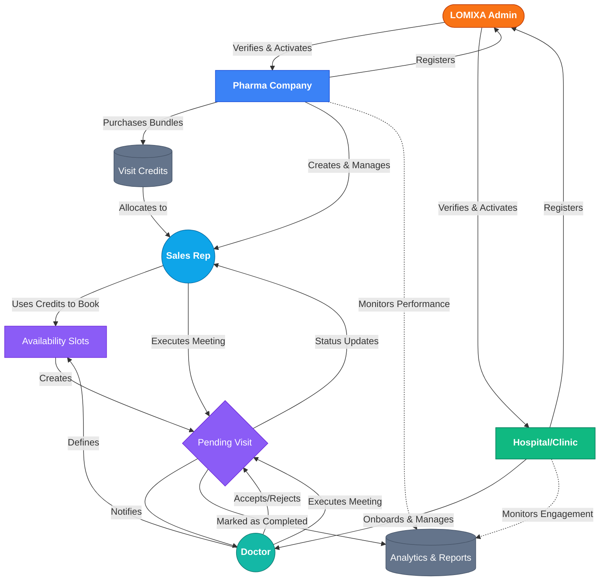

# 🚀 LOMIXA - Premium Medical & Pharma Connectivity Portal

<div align="center">
  
</div>

**LOMIXA** is a pioneering, enterprise-grade healthcare platform established to bridge the professional gap between Pharmaceutical Innovators and Medical Healthcare Providers. By decentralizing and organizing representatives' interactions with doctors, LOMIXA drastically enhances clinical workflow harmony through intelligent scheduling, credit-based booking architectures, and encrypted real-time communications.

---

## 🗺️ High-Level System Architecture & Flow

The following diagram illustrates the complete operational lifecycle inside the LOMIXA ecosystem—from initial verification to successful visit completion.



---

## 🌟 Core Features & Modules

### 👑 LOMIXA Admin Desk
- **Grid Security**: Manually review, vet, and verify newly registered Hospitals and Pharma companies before allowing them onto the network.
- **Ecosystem Oversight**: Control global platform metrics, user densities, and resolve active bundle purchase queries.

### 🏢 Pharma Control Center
- **Subordinate Management**: Create, edit, and organize field Sales Representatives.
- **Credit Economics**: Purchase high-value Visit Bundles utilizing secure virtual transfers, then distribute these allocated credits to individual representatives dynamically.
- **Advanced Analytics**: Monitor rep targets, monthly completion statistics, and general field success pipelines.

### 🏥 Hospital & Clinic Portal
- **Clinical Roster Setup**: Independently rapidly onboard staff Doctors as 'Pre-Verified' network participants, skipping global-admin congestion.
- **Engagement Surveillance**: Track exactly how much time your clinical staff spends interacting with Pharma reps through comprehensive analytics endpoints.

### 🩺 Doctor Hub
- **Availability Matrix**: Fine-tune daily/weekly booking slots precisely defining when Representatives can request an audience.
- **Direct Connectivity**: Accept or decline inbound visits seamlessly; engage via In-Person routing, Video Tele-conferencing, or Phone.

### 💼 Field Representative (Rep) Dashboard
- **Visit Planner**: Search the global network for highly-rated Doctors or target specific Hospitals.
- **Credit-Authorized Booking**: Convert allocated pharma credits into direct, scheduled appointments into a Doctor's open slots.
- **Visit Tracking**: Keep live tabs on Pending, Confirmed, and Completed visits, complete with Post-Visit outcome summaries.

---

## 🛠️ Technology Stack

- **Frontend Application**: React (via Vite compiler)
- **Styling Architecture**: Tailwind CSS v4 & Framer Motion (for highly fluid interactions)
- **Authentication & Backend**: Supabase (PostgreSQL handling RLS, Auth flows, and real-time triggers)
- **Internationalization (i18n)**: `i18next` (Seamless multi-lingual Arabic/English real-time LTR/RTL transitioning)
- **Resilient Data State**: Hardened Hybrid-Local Persistence algorithm that gracefully merges memory-mapped states with live Supabase datasets.
- **Virtual Meetings**: Integrated WebRTC Jitsi components for immediate Video calls.

---

## 🚀 Getting Started

### Prerequisites
- Node.js (v18+)
- Active Supabase Project configuration

### Installation

1. **Clone & Install Dependencies**:
   ```bash
   git clone [repository-url]
   cd Lomixa
   npm install
   ```

2. **Configure Environment Variables**:
   Create a `.env` file referencing your Supabase project keys:
   ```env
   VITE_SUPABASE_URL=your-supabase-url
   VITE_SUPABASE_ANON_KEY=your-supabase-anon-key
   ```

3. **Database Initialization**:
   Run the provided `supabase_schema.sql` script within your Supabase SQL Editor to rapidly deploy the tables, constraints, and Row Level Security (RLS) policies necessary to operate the multi-role environment.

4. **Launch Application**:
   ```bash
   npm run dev
   ```

---

## 🧪 Security & Quality Verification

Before utilizing LOMIXA in a live healthcare environment, confirm these critical conditions:

- [x] **Role Access Isolation**: A 'Doctor' strictly cannot navigate or fetch endpoints belonging to a 'Pharma'.
- [x] **Row Level Security (RLS)**: The Supabase schema properly asserts that data mutations are restricted purely to authorized hierarchy paths.
- [x] **State Cohesion**: The system successfully prevents overwrite collisions when merging local storage states with cloud states upon rapid rep re-allocations (Zero Credit-loss bugs).
- [x] **Bilingual Completeness**: The interface transitions cleanly between English and Arabic semantics including layout direction.
