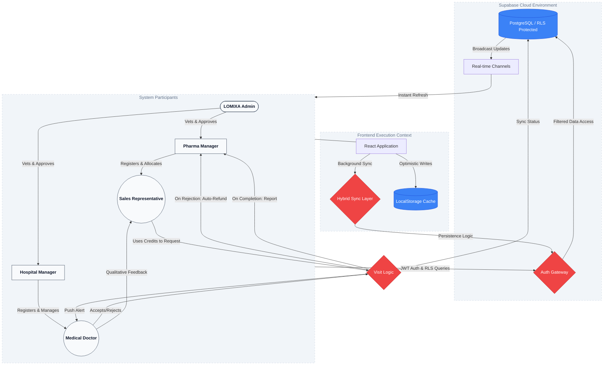

# 🚀 LOMIXA - Premium Medical & Pharma Connectivity Portal

<div align="center">
  
</div>

**LOMIXA** is a pioneering, enterprise-grade healthcare platform established to bridge the professional gap between Pharmaceutical Innovators and Medical Healthcare Providers. By decentralizing and organizing representatives' interactions with doctors, LOMIXA drastically enhances clinical workflow harmony through intelligent scheduling, credit-based booking architectures, and encrypted real-time communications.

---

## 🗺️ High-Level System Architecture & Flow

The following diagram illustrates the complete operational lifecycle inside the LOMIXA ecosystem—from initial verification to successful visit completion and the subsequent quality/feedback loop.



---

## 🌟 Core Features & Modules

### 👑 LOMIXA Admin Desk
- **Grid Security**: Manually review, vet, and verify newly registered Hospitals and Pharma companies before allowing them onto the network.
- **Financial Audit**: Consolidated "Income History" and auditing for global bundle purchases.
- **Ecosystem Oversight**: Control global platform metrics and resolve active entity queries.

### 🏢 Pharma Control Center
- **Balance Synchronization**: Robust, bidirectional data persistence between local state and cloud datasets for Visit Fund management.
- **Subordinate Management**: Create, edit, and organize field Sales Representatives with individual balance allocation.
- **Advanced TPA Analytics**: Monitor Targets vs. Performance (TPA) with real-time completion statistics.

### 🏥 Hospital & Clinic Portal
- **Organizational Routing**: Logic-driven paths for "Hospital" vs "Clinic" identity with immutable role designations to ensure data integrity.
- **Roster Expansion**: Direct interface for clinical staff onboarding; Doctors are managed as subordinate entities with mandatory specialty mapping.
- **Engagement Analytics**: Monitoring logic for clinical staff interaction frequency and departmental engagement levels.

### 🩺 Doctor Hub
- **Specialty Matching Logic**: Doctors register with mandatory specialty tokens (e.g., Cardiology, Neurology) to enable accurate Rep-to-Doc discovery.
- **Availability Matrix**: Configurable time-slot logic defining the exact windows available for inbound visit requests.
- **Interaction Management**: Business logic for accepting/declining visits with automated state transitions and audit logging.
- **Peer Accountability**: Structural feedback loop allowing Doctors to quantify Representative performance and provide qualitative clinical data.

### 💼 Field Representative (Rep) Dashboard
- **Optimized Visit Booking**: Search doctors/hospitals via professional select-based interface with automatic credit refunding on rejection.
- **Post-Visit Reporting**: Structured outcome forms to document interaction summaries and follow-up requirements.
- **Target Tracking**: Real-time progress monitoring against monthly performance benchmarks.

### 💸 Credit & Transactional Logic
- **Atomic Credit Allocation**: Pharma companies purchase bundles that inject credits into a managed pool. Credits are atomically deducted when a Sales Rep initiates a booking.
- **Automated Refund Mechanism**: If a visit request is rejected by a Doctor or cancelled within the valid window, the system triggers an immediate credit restoration to the Pharma/Rep wallet.
- **Financial Auditing**: Admins have a global view of all credit injections and transactions to ensure fiscal transparency.

### 🛡️ Multi-Tenant Access Control (RBAC)
- **Identity Isolation**: Strict backend enforcement (RLS) ensures that a 'Doctor' cannot access 'Pharma' endpoints, and 'Hospitals' can only manage Doctors within their own roster.
- **Verification Gating**: A "Pending Approval" state blocks all non-admin roles from accessing functional dashboards until their registration is manually vetted by LOMIXA staff.

### 🔄 Data Cohesion & Synchronization
- **Hybrid Persistence Algorithm**: The system uses a multi-layered sync logic that merges local memory-mapped state with Supabase cloud datasets, resolving conflicts based on server-side timestamps.
- **Case-Insensitive Identity Guard**: Universal uniqueness checks on Email and Phone numbers across all roles (Admin, Pharma, Hospital, Doctor, Rep) to prevent duplicate identity fragmentation.

### 🔔 Notification Hub
- **Real-time Alerts**: Global notification system for booking requests, status updates, and peer reviews.
- **Transactional Communication**: Integrated automation for critical account events including verification codes and account approval/rejection notices.

---

## 🛠️ Technology Stack

- **Frontend Application**: React (via Vite compiler)
- **Styling Architecture**: Tailwind CSS v4 & Framer Motion (for highly fluid interactions)
- **Authentication & Backend**: Supabase (PostgreSQL handling RLS, Auth flows, and real-time triggers)
- **Email Notifications**: Resend API (Automated transactional emails for system-wide alerts)
- **Internationalization (i18n)**: `i18next` (Seamless multi-lingual Arabic/English real-time LTR/RTL transitioning)
- **Resilient Data State**: Hardened Hybrid-Local Persistence algorithm that gracefully merges memory-mapped states with live Supabase datasets.
- **Virtual Meetings**: Integrated WebRTC Jitsi components for immediate Video calls.

---

## 🚀 Getting Started

### Prerequisites
- Node.js (v18+)
- Active Supabase Project configuration
- Resend API key (optional for local dev)

### Installation

1. **Clone & Install Dependencies**:
   ```bash
   git clone [repository-url]
   cd Lomixa
   npm install
   ```

2. **Configure Environment Variables**:
   Create a `.env` file referencing your Supabase project keys:
   ```env
   VITE_SUPABASE_URL=your-supabase-url
   VITE_SUPABASE_ANON_KEY=your-supabase-anon-key
   VITE_RESEND_API_KEY=your-resend-key
   ```

3. **Database Initialization**:
   Run the provided `supabase_schema.sql` script within your Supabase SQL Editor to rapidly deploy the tables, constraints, and Row Level Security (RLS) policies.

4. **Launch Application**:
   ```bash
   npm run dev
   ```

---

## 🧪 Security & Quality Verification

- [x] **Role Access Isolation**: A 'Doctor' strictly cannot navigate or fetch endpoints belonging to a 'Pharma'.
- [x] **Universal Uniqueness**: Enforced case-insensitive "one email per system" and "one phone per system" uniqueness across the global network.
- [x] **Row Level Security (RLS)**: Data mutations are restricted purely to authorized hierarchy paths.
- [x] **State Cohesion**: Prevention of overwrite collisions when merging local storage with cloud states.
- [x] **Bilingual Completeness**: Interface transitions cleanly between English and Arabic including layout direction and iconography.
